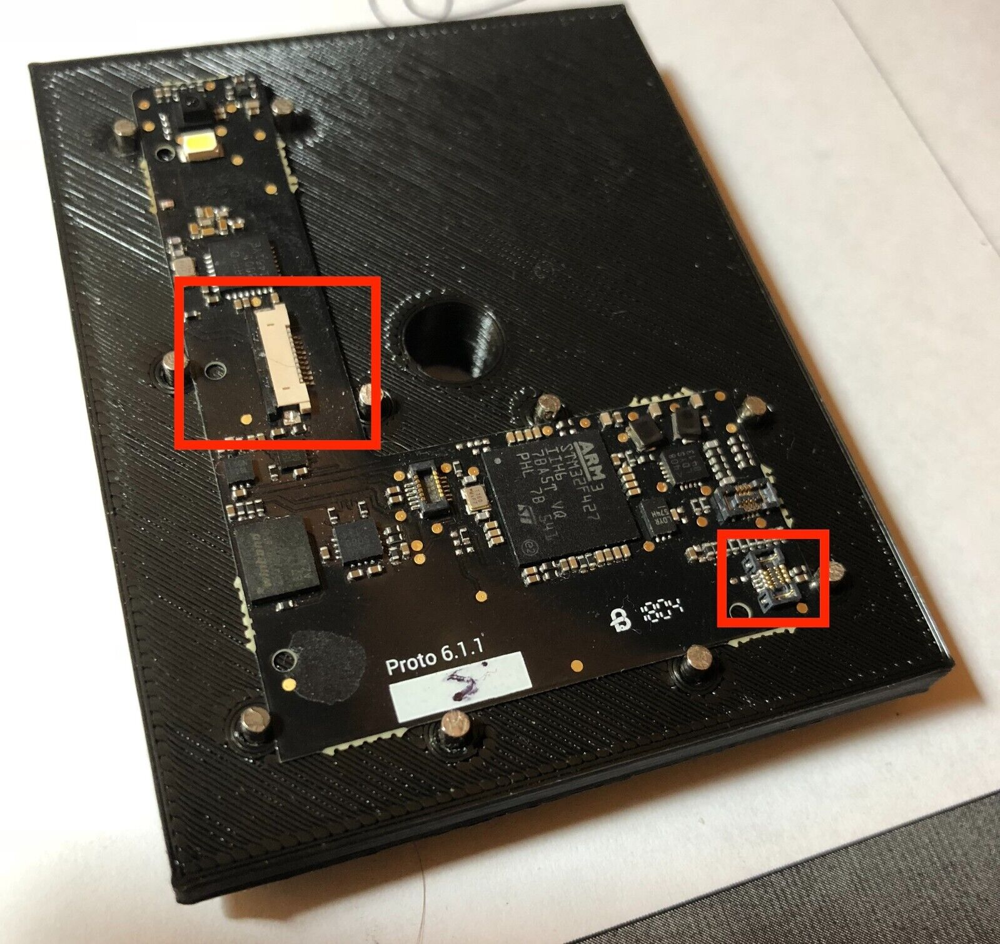
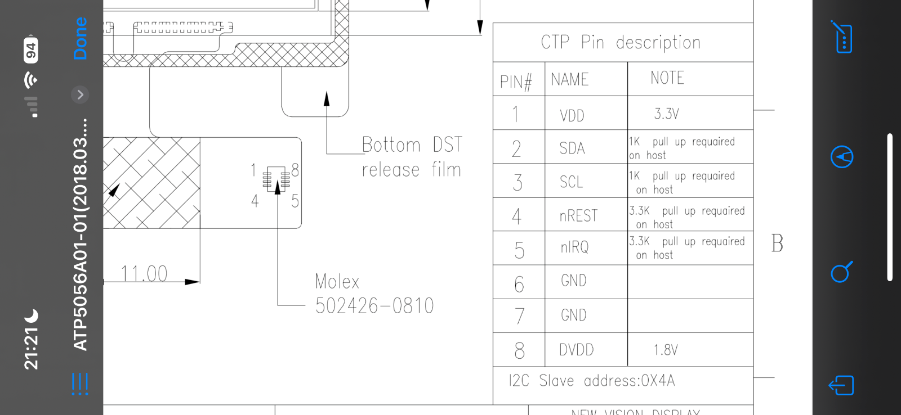

### Sharp Low Consumption Versatile PCB

This will host the PCB KiCad files for a  board that aims to be a low consumption driver for SHARP 2.7" MIP LCDs with optional touch.
This is a current work in project and by any means ready to send anywhere to production. The factory we use to produce our prototypes and final PCBs is [JLCPCB.com](https://jlcpcb.com)

### How with touch ?

The person that sold this in eBay had a BTC wallet project that didn't see the light as a product, and combined a Microchip Atmel capacitive touch with a Sharp 400x240 memory LCD:

Resulting in that he has a nice amount of this combination to sell in eBay.

**TOUCH PINOUT**

### Goals to achieve with this board

Just a quick wishlist for this PCB wishes, in version 1.0 just want to get the basics working, no add-ons maybe just a QWIIC connector that is cheap:

1. Display working with external Resonator CrystalFonts RV3032 so the MCU can go to sleep and we can keep the LCD running
2. touch connector with the Molex part  C563931
3. Ready for LVGL
4. BLE working at least for 20 meters receiving and sending data packages

### Reference working designs 

[Altium example for nRF52](https://resources.altium.com/p/getting-started-nrf52-mcu-pcb)

[Mike Rankin Oled PCB](https://github.com/mike-rankin/nRF52832_Oled_Board)
